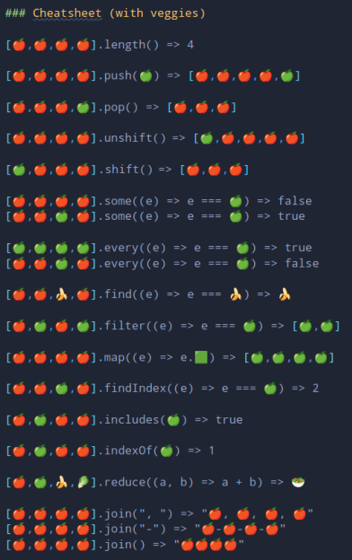

# Challenge week 5

### Functions for Array methods

##### First test project using JEST framework, Github Actions (CI/CD) and SonarCloud (Clean Code)

Create a module with functions that replicate, without using any of the existing methods in the prototype, the following array methods:**_length, push, pop, unshift, shift, some, every, find, filter, map, findIndex, includes, indexOf, reduce, join:_**. Any of your functions can use the ones you have already created.

#### Project conditions

-   Test ALL methods.
-   Use Github Actions Audit in the Github flow.
-   Configure SonarCloud associated with your repository, including test coverage.
-   Create a repo as usual, with the same hook husky as before.
